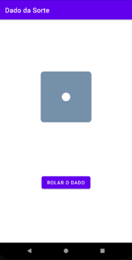
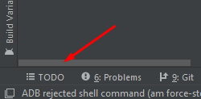

#### Oque vamos construir?

Hoje vamos estar colocando em prática todo o conhecimento adquirido nos tutoriais anteriores. Vamos construir um aplicativo de rolar o dado randomicamente.



Primeiramente, execute o comando abaixo para clonar o projeto

 ```
 git clone 'https://github.com/AndroidMaster21/DadoDaSorte.git'
 ```

Agora sim, vamos por a mão na massa!

## Introdução

Como viram na imagem, no XML há basicamente um ImageView e um Button. A funcionalidade funcionalidade do botão é trocar aleatoriamente a imagem do ImageView por uma outra imagem (face do dado). 
> Id do ImageView = **imgDice**  
> Id do Button = **button**  
> **Obs:** Todas as imagens estão incluidas no projeto

<br>
<br>



Para verificar os passos a serem seguidos, clique em **TODO** _(canto inferior esquerdo)_ e veja os 8 passos que realizaremos nesse post

> Fique a vontade para clicar nos **TODOs** e realizar por você mesmo, se quiser.

## Implementação

#### Passo 1:

Defina a variável do ViewBinding, pois estaremos iniciando-a no método `onCreate()` da MainActivity

```kotlin
    lateinit var binding: ActivityMainBinding
```

#### Passo 2:

Crie um array com os ids das imagens dos 6 lados do dado. Pois no passo 6 e 7 vamos estar gerando um valor aleatório e vamos acessar essa array usando esse número.

```kotlin
    val faces = arrayListOf(
            R.drawable.dice_1,
            R.drawable.dice_2,
            R.drawable.dice_3,
            R.drawable.dice_4,
            R.drawable.dice_5,
            R.drawable.dice_6
    )
```

#### Passo 3:

Inicialize a variável do ViewBinding usando o método `inflate()` e passando o `layoutInflater` como parêmetro

```kotlin
    binding = ActivityMainBinding.inflate(layoutInflater)
```


#### Passo 4:

Definir o ContentView da Activity passando o `binding.root` como parêmetro

```kotlin
    setContentView(binding.root)
```

#### Passo 5:

Definir o ContentView da Activity passando o `binding.root` como parêmetro

```kotlin
    binding.button.setOnClickListener {
        // TODO 6

        // TODO 7

        // TODO 8
    }
```

#### Passo 6:

Use o método `nextInt()` para gerar um número aleatório entre 0 e 5 e salve em uma variável pois vamos usar no próximo passo.   

```kotlin
    val numeroAleatorio = Random.nextInt(0, 6) 
```
> O primeiro parâmetro é o número inicial **(incluindo-o)** e o segundo é o ultimo final **(excluindo-o)** 

**Exemplo:**
```kotlin
Random.nextInt(0, 10) // Número aleatório entre 0 e 9
```

**Obs:** Lembre-se que começamos a contar do 0 em programação, mesmo que gere um número entre 0 e 9, ainda temos 10 possibilidades de números


#### Passo 7:

Use esse número aleatório para acessar o array de faces e salve em uma variável. Use o método `getDrawable()` para "pegar" a imagem da pasta `res` passando o `idEscolhido`.

```kotlin
    val idEscolhido = faces[numeroAleatorio]
    val imagem = ContextCompat.getDrawable(this, idEscolhido)
```


#### Passo 8:

Para finalizar, atualize a imagem do ImageView usando o método `setImageDrawable()` passando a imagem que você "pegou" no ultimo passo.

```kotlin
    binding.imgDice.setImageDrawable(imagem)
```

## Prontinho!

Agora rode a aplicação, clique no botão várias vezes e verá o dado mudando de face randomicamente. Parabéns, você finalizou o seu primeiro projeto!  


> Se algo deu errado no projeto, veja a solução digitando o comando abaixo

```
git checkout solution
```


Finalmente finalizamos o primeiro capítulo do nosso blog! No próximo vamos aprofundar algúns conceitos vistos nesse capítulo e aprender sobre Jetpack Compose.