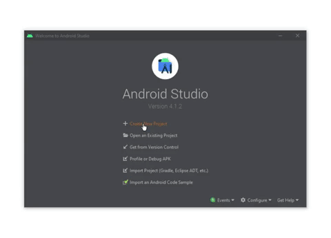
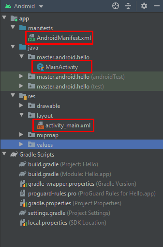
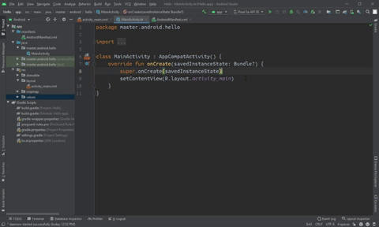

Olá, seja bem-vindo ao **Android Master**!  
Aqui você aprenderá desde os conceitos mais básicos até os mais avançados no android. Vamos estar utilizando [kotlin](https://kotlinlang.org/) como linguagem de desenvolvimento e o [Android Studio](https://developer.android.com/studio?hl=pt-br) como IDE. Nesse post vamos abordar assuntos importantes para o entendimento de tópicos futuros.


#### Android Studio

O Android Studio é o IDE _(Integrated Development Environment)_ padrão para desenvolvimento Android. Ele traz diversas ferramentas para auxiliar no processo de desenvolvimento, testes e depuração de aplicações. Por isso, vamos usar-lo. Faça do download do Android Studio e instale-o no local de preferência.
> Escolha um local no seu computador que não contenha espaços, caracteres especiais ou acentuados.
  
#### Criação do projeto

1. Na tela de boas vindas há várias opções de como abrir um projeto, dentre elas selecione **Start a new Android Studio Project**



2. Será exibida a tela do assistente de criação do projeto, onde é possível adicionar uma Activity ao projeto. Selecione **Empty Activity** e clique em **Next**
> Activity é responsavel por criar uma janela no seu aplicativo

3. No campo **Name** devemos preencher o nome do aplicativo.  

4. Em **Package Name** devemos informar o nome do pacote, ou seja, onde ficarão as classes do projeto.
> O Package Name também serve como identificador único do aplicativo. Importante escolher um id único (um domínio invertido), pois isso vai ser usado pela Google Play para identificar o seu aplicativo.  
> **Domínio:** exemplo.com.br  
> **Package Name:** br.com.exemplo
  
5. Em seguida, em **Save Location** podemos selecionar o local em que o projeto será salvo. Por padrão, todos os seus projetos ficarão armazenados no subdiretório _AndroidStudioProjects_ dentro do diretório do seu usuário.
  
6. Como kotlin foi oficialmente anunciado como a principal linguagem de desenvolvimento Android no Google I/O em 2017, vamos estar utilizando-o. No campo **Language**, selecione Kotlin.

7. No campo **Minimum API Level**, devemos selecionar a versão mínima do Android para conseguir executar a aplicação. No momento deste post, mais de 94% usam a versão 5.0 (API Level 21) do Android ou superior, então marque-o.

8. Selecione a opção **Use legacy android.support libraries** para usar o Android Jetpack e clique em **Finish**

#### Estrutura do Projeto

Quando o projeto iniciar, na parte esquerda estarão as diretórios e arquivos do projeto, como na imagem a seguir:



###### 1. AndroidManifest.xml

No Arquivo _AndroidManifest.xml_ fica boa parte das informações que foram colocadas na criação do projeto. Ela armazenará informações importantes como: permissões, requisitos de hardware, serviços etc.:

```kotlin

<?xml version="1.0" encoding="utf-8"?>
<manifest xmlns:android="http://schemas.android.com/apk/res/android"
    package="master.android.hello">

    <application
        android:allowBackup="true"
        android:icon="@mipmap/ic_launcher"
        android:label="@string/app_name"
        android:roundIcon="@mipmap/ic_launcher_round"
        android:supportsRtl="true"
        android:theme="@style/Theme.Hello">
        <activity android:name=".MainActivity">
            <intent-filter>
                <action android:name="android.intent.action.MAIN" />

                <category android:name="android.intent.category.LAUNCHER" />
            </intent-filter>
        </activity>
    </application>

</manifest>
```  

Na tag `<manifest>` é definido o pacote da aplicação e na tag `<application>` são adicionadas algumas configurações do aplicativo, como:
 * Ícone
 * Nome do Aplicativo
 * Tema
 * Activities

> Todas as **Activities** que serão exibidas ao usuário devem estar declaradas nesse arquivo com a tag `<activity>`.

###### 2. MainActivity.kt

A _MainActivity_ é a primeira janela que será executado quando o usuário abrir o aplicativo.

```kotlin
package master.android.hello

import android.support.v7.app.AppCompatActivity
import android.os.Bundle

class MainActivity : AppCompatActivity() {
    override fun onCreate(savedInstanceState: Bundle?) {
        super.onCreate(savedInstanceState)
        setContentView(R.layout.activity_main)
    }
}
``` 

* Ela é uma Subclasse do `AppCompatActivity` _(essa SuperClasse é responsável pela compatibilidade entre as diferentes versões do android)_ 
* Possui por default a função `onCreate()`, que irá ser executada ao inicar a Activity. 
* Nessa função há um parametro `savedInstanceState` do tipo **Bundle** que permite restaurar o estado anterior de uma Activity ao recriar-la.
* O `setContentView()` defini qual layout será mostrado para o usuário.


###### 3. Arquivo de Layout

Segure **_ctrl_**, clique no **R.layout.activity_main** e abrirá o arquivo de layout da Activity. Há três maneiras de visualizar esse arquivo:
1. **Design** - Auxilia e facilita o desenvolvimento de telas, pois possui funcionalidade de drag-and-drop de componentes.
2. **Split** - Visualização do código XML e o preview do lado.
3. **Code** - Visualização do código XML



Aqui é onde será colocado a parte gráfica de uma Activity. Por padrão, o arquivo é inicializado com um **TextView** com propiedade `android:text= "Hello World!"` dentro de uma `ConstraintLayout`
- **TextView** - Um componente que serve para exibir texto estático na tela.
- **ConstraintLayout** - Gerenciador de Layout que posiciona os componentes baseado em regras.

## That's it!
Você criou o seu primeiro projeto!  
  
No próximo post, vamos configurar algumas coisas e rodar a aplicação em um dispositivo android.

