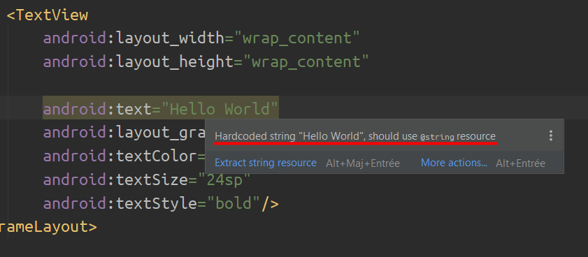
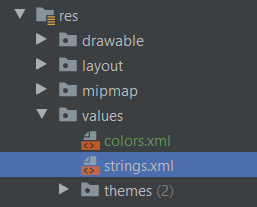
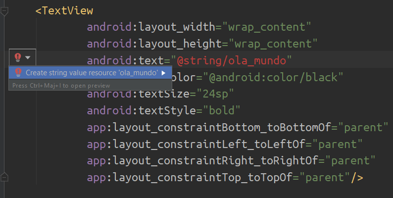
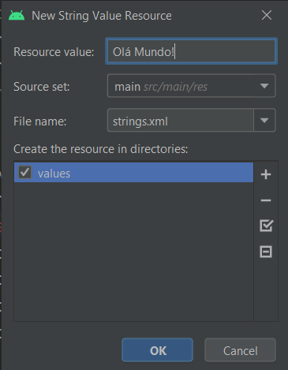

Nos posts anteriores, vimos que não é legal implementar strings diretamente nos arquivos de layout. Nesse post, demonstrarei como a Resources folder é articulada e como usar os arquivos de recursos em seu código, seja em Kotlin ou XML.

#### HardcodedText

Quando passamos uma string diretamente á um componente, recebemos o alerta abaixo:


> Hardcoded string "Hello World", deve usar o recurso @string


## Resources folder

A **pasta de recursos** é onde deve ficar todos os recursos do seu aplicativo, tais como imagens, strings, cores, layouts etc. Deve-se sempre separar os recursos do aplicativo do seu código para manter o seu código bem separado e independente.

    MyProject/
        src/
            MyActivity.java
        res/
            drawable/
                graphic.png
            layout/
                main.xml
                info.xml
            values/
                strings.xml


Como você pode ver neste exemplo, o diretório `res/` _(abreviação de resources)_ contém todos os recursos (em subdiretórios):   Um recurso de imagem, dois arquivos de layout e um arquivo de recurso de string.

##### Diretórios importantes

* **drawable**
    * Arquivos bitmap (.png, .9.png, .jpg, .gif)
* **layout**
    * Arquivos XML que definem um layout de interface do usuário
* **values**
    * Arquivos XML que contêm valores simples, como strings, inteiros e cores.
        * **color.xml** para [valores de cores](https://developer.android.com/guide/topics/resources/more-resources#Color)
        * **arrays.xml** para arrays de recursos ([typed arrays](https://developer.android.com/guide/topics/resources/more-resources#TypedArray))
        * **strings.xml** para [valores de string](https://developer.android.com/guide/topics/resources/string-resource)

> <a href="https://developer.android.com/guide/topics/resources/providing-resources#table1" target="_blank">Veja mais diretórios</a>

## Arquivo de recursos

Vamos usar o values/**strings.xml** para exemplificar um arquivo de recursos. 



Abra o arquivo de recursos **strings.xml**.

```kotlin
<?xml version="1.0" encoding="utf-8"?>
<resources>
    <string name="app_name">Hello</string>

</resources>
```

Em todo arquivo de recurso há uma tag `<resources>` e dentro dela há seus recursos, que no nosso exemplo são tags **string**. Todos o recursos possuem um parametro `name` que serve para identifica-lo, e o valor do recurso entre os `> <`.
  
E adicione a seguinte linha abaixo da tag **string**:


```kotlin
<string name="ola_mundo">Olá Mundo</string>
```

## Acessando os recursos

Depois de fornecer um recurso em seu aplicativo, você pode aplicá-lo referenciando o tipo e o `name` do recurso. Existem duas formas de acessar-los:

1. **No código Kotlin:** Usa-se a classe `R`, como:
```
R.string.ola_mundo
```

2. **No XML:** Usa-se uma sintaxe XML especial, como:

```
@string/ola_mundo
```

> **string** é o tipo de recurso e **ola_mundo** é o nome do recurso em ambos casos.

---

<h2 id="resposta">Resposta</h2>

No campo de `text` do TextView, adicione **"@string/ola_mundo"**. Isso provocará um erro caso não haja um recurso do tipo string com o `name` **ola_mundo**.



Clique em **Create string value resource 'ola_mundo'** e a seguinte janela aparecerá:



Em **Resource value** defina o valor do recurso, que no nosso caso é: **"Olá Mundo!"**. Clique **OK** e verá o seu TextView mostrando sua mensagem:


# That's it!

Nesse post vimos como usar os arquivos de recursos e como implementar-los. Nos próximos posts focaremos em como ligar a interface (UI) ao código kotlin e em implementar funcionalidades ao seu aplicativo.

