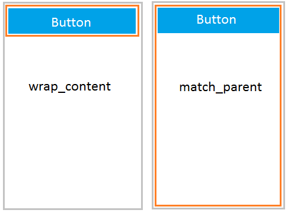

Quando geramos um projeto no Android Studio, observamos que automaticamente é gerado um arquivo de layout com um `TextView`. Nesse post apresentarei alguns dos componentes do android, como o **_TextView_**, e suas funcionalidades essenciais.

## Conceitos básicos

Bom, todo componente no android é representado por uma Tag no arquivo de layout. Veja um Exemplo:

```kotlin
<ComponenteExemplo  
    
    ...

    />
```

Dentro do componente é possível adicionar várias propiedades que varia de componente para componente. No entanto, algumas propiedades são obrigatórias em todos os componentes, como o `android:layout_width` e o `android:layout_height`, que determinam o tamanho da largura e da altura, respectivamente. Ambos recebem os valores **"wrap\_content"**, **"match\_parent"** ou **"um valor fixo"**.

1. **"wrap_content"**
    * Define o tamanho _(largura e da altura)_ do componente baseado no seu conteudo. Ou seja, quanto maior o seu conteúdo, maior o componente.

2. **"match_parent"**
    * Preenche o tamanho total do componente pai. Ou seja, vai se expandir até que preencha todo o tamanho do pai.

3. **"100dp"**
    * A tela é medida em DP _(ou DIP - Density Independent Pixels)_, que é uma unidade de medida que leva em consideração a quantidade de pixels em sua área física. Ou seja, o componente iria possuir **"100dp"** na tela.

 

##TextView

Caso tenha visto o post anterior, pudemos observar que ele é um texto estático e que possui várias propiedades dentro dele. Vamos dar uma olhada em algumas delas:

```kotlin
<TextView
        android:layout_width="wrap_content"
        android:layout_height="wrap_content"

        android:text="Hello World"
        android:textColor="@android:color/black"
        android:textSize="24sp"/>
```
* Como já vimos, o `android:layout_width` e o `android:layout_height` definem o tamanho (altura e largura) do componente.

* O `android:text` é uma String que será mostrado como texto estático para o usuário. No entanto, **definir esse atributo diretamente no arquivo de layout é ruim por 2 motivos**:
    * Ao criar variações de layout (landscape ou portrait), você deve repetir o texto real e mantê-lo atualizado ao fazer alterações;

    * O aplicativo não pode ser traduzido para outros idiomas.

* O `android:textColor` define a cor do texto referenciando a um recurso do tipo Color.

* Com o `android:textSize` é possível alterar o tamanho da font usando a unidade de medida SP **_(Scalable Pixels)_**.


Deve-se colocar todas as Strings que aparecerão para o usuário na **Resources folder** em um **[Arquivo de recursos](../arquivo-de-recursos)**.

## EditText

É uma caixa de texto que permite o usuário, ao clicar, digitar texto dentro dele. É possivel escolher o tipo de texto que será digitado, como: **Nome pessoal, email, senha, numeros**, dentre outros.

```kotlin
<EditText
    android:layout_width="250dp"
    android:layout_height="wrap_content"

    android:hint="Digite o seu nome..."
    android:inputType="textPersonName"
    android:maxLines="1" />

```

* Podemos usar todos os atributos de um TextView no EditText

* `android:hint` mostra uma **dica** ao usuário do que deve ser digitado nesse campo.

* `android:inputType` ajuda o android a escolher melhor tipo de teclado para mostrar baseado no tipo de texto que vai ser digitado. [Ver mais](https://developer.android.com/reference/android/widget/TextView#attr_android:inputType)
    * **Por exemplo:** _Se o inputType for de **number**, o teclado mostrará apenas numeros._

* `android:maxLines` define o numero máximo de linhas do EditText

## Button


## findViewById
## ViewBinding
