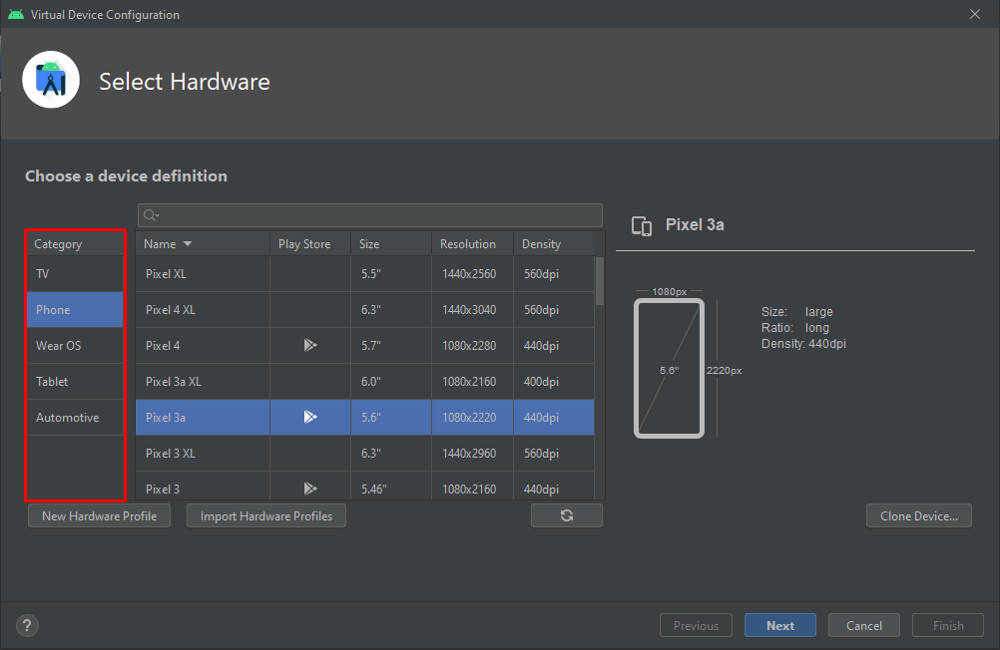

Agora que você já entende um pouco da estrutura básica e criou seu primeiro projeto Android, vamos aprender como rodar-lo em um dispositivo. Há duas maneiras de realizar isso: usando um aparelho Android _ou_ um emulador. Vamos abordar os dois tópicos nesse post.

#### Configuração do aparelho

Para conseguir rodar o seu aparelho real, o primeiro passo é habilitar as **Opções do desenvolvedor**. 
>Para ativar, toque em _Número da versão_ 7 vezes. Você pode encontrar essa opção em um dos seguintes locais, dependendo da versão do Android

* Android 9 ou mais recente:   
**Configurações > Sobre o dispositivo > Número da versão**

* Android 8.0 e Android 8.1:  
**Configurações > Sistema > Sobre o dispositivo > Número da versão**

* Android 7.1 e anteriores:  
**Configurações > Sobre o dispositivo > Número da versão**

> As Opções do Desevolvedor permite coisas como: exibir limites de layout, mostrar toques na tela, depuração USB, definir a velocidade das animações etc.

Após isso, a opção aparecerá nas **Configurações > Sistema**. Clique em **Opções do desenvolvedor** e ative a função **Depuração USB**

Em seguida, conecte o seu dispositivo ao computador por meio de um cabo USB. Caso apareça alguma mensagem de confirmação, confirme para permitir acesso ao seu aparelho.

#### Android Virtual Device

Um Android Virtual Device (AVD), é um emulador Android no qual podemos testar nossas aplicações diretamente no nosso computador. Podemos configurar a versão do sistema, tamanho de tela etc. Para criar um AVD, dentro do Android Studio selecione a opção **Tools > AVD Manager** ou clique no ícone no topo do lado direito.

Essa janela aparece todos os AVDs criados, caso não tenha nenhum, clique em **Create Virtual Device**. É possível escolher a categoria desejada e um dos modelos Nexus ou Pixel. Escolha um modelo que possúi o símbolo da Google Play e clique em **Next**.

Na próxima janela poderemos escolher a versão Android do emulador. A Google recomenda escolher a API mais alta, no momento desse post, é a **API Level 30**. Selecione ou faça o download se necessário, e clique em **Next**.

Após isso, abrirá a ultima janela de configuração do AVD, onde podemos selecionar coisas como: nome do emulador, camera, modo de Inicialização etc. Caso queira customizar o nome do AVD, mude no campo **AVD Name** e clique em **finish**.

#### Executando a aplicação

Para executar a aplicação, escolha o dispositivo e clique em **Run App** (Botão verde com símbolo de play).

## There it is!

Finalmente seu primeiro _"Hello World!"_ no android!

# Exercício

Mude o texto do `TextView` para _"Olá Mundo!"_ e execute a aplicação novamente.